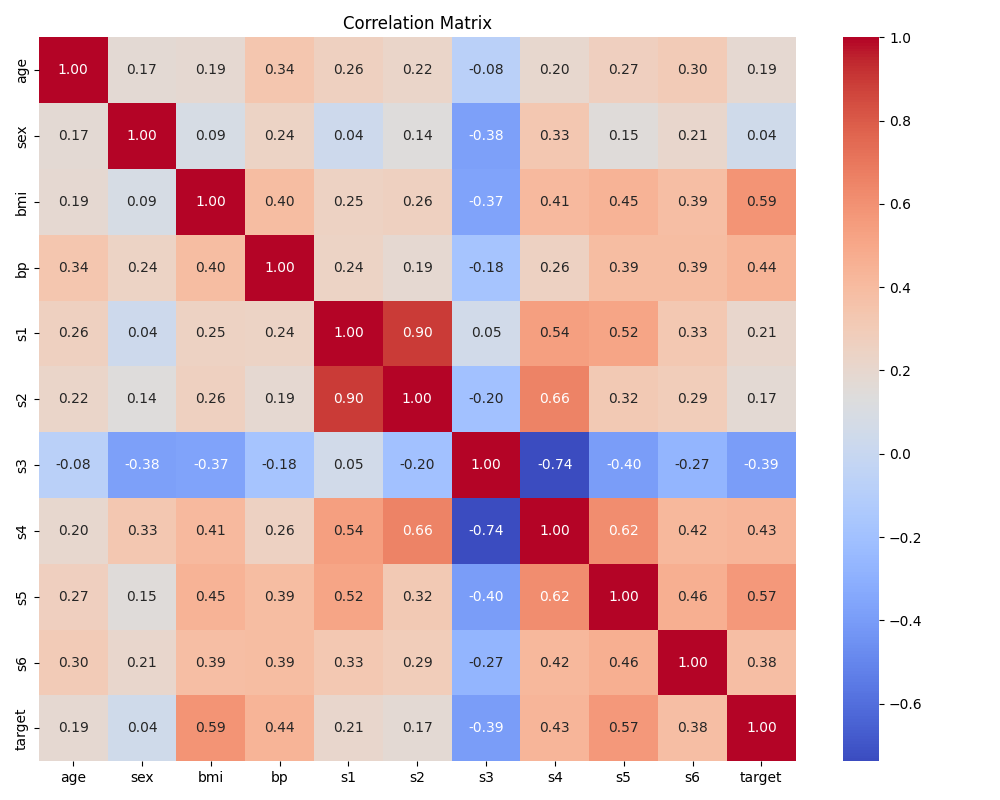
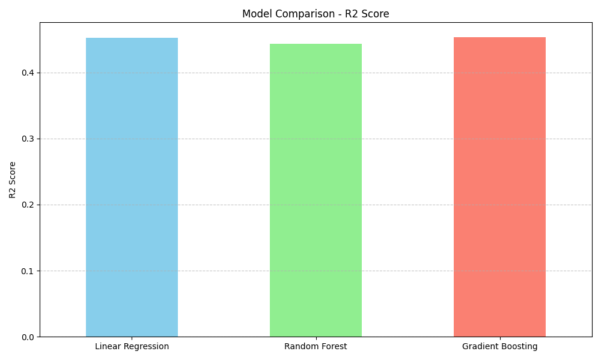

# Diabetic Prediction ML Project

This project predicts the disease progression of diabetes in patients based on various diagnostic measurements. It utilizes the **Diabetes Dataset** provided by the Scikit-Learn library.

## Dataset Information

We use the standard `sklearn.datasets.load_diabetes` dataset.

-   **Type:** Regression
-   **Features:** 10 baseline variables (age, sex, body mass index, average blood pressure, and six blood serum measurements).
-   **Target:** A quantitative measure of disease progression one year after baseline.
-   **Samples:** 442 instances.

Unlike binary classification tasks (Diabetic vs Non-Diabetic), this project focuses on **predicting the severity/progression** of the disease, which is valuable for personalized treatment planning.

## Project Structure

-   `analysis.py`: Main script to load data, perform EDA, train models, and evaluate results.
-   `images/`: Directory containing generated EDA and evaluation plots.
    -   `correlation_matrix.png`: Heatmap showing relationships between features.
    -   `target_distribution.png`: Histogram of the disease progression values.
    -   `bmi_vs_target.png`: Scatter plot showing the strong relationship between BMI and disease progression.
    -   `model_comparison.png`: Bar chart comparing R2 scores of different models.
    -   `pred_vs_actual_*.png`: Scatter plots for each model showing predicted vs actual values.

## Machine Learning Models Used

We trained and evaluated the following regression models:

1.  **Linear Regression:** A baseline linear approach.
2.  **Random Forest Regressor:** An ensemble method using multiple decision trees.
3.  **Gradient Boosting Regressor:** An ensemble technique that builds trees sequentially to minimize errors.

## Analysis and Results

After training the models on an 80-20 train-test split, we obtained the following results:

| Model | MSE (Mean Squared Error) | R2 Score |
| :--- | :--- | :--- |
| **Linear Regression** | 2900.19 | 0.4526 |
| **Random Forest** | 2952.01 | 0.4428 |
| **Gradient Boosting** | 2898.44 | 0.4529 |

### Conclusion

-   **Best Model:** **Gradient Boosting Regressor** performed the best, achieving the highest R2 score of **0.4529** and the lowest Mean Squared Error.
-   **Comparison:** Linear Regression performed very similarly to Gradient Boosting, indicating that the relationship between the features and the target is largely linear. Random Forest performed slightly worse in this specific run.
-   **Recommendation:** For this specific dataset, **Gradient Boosting** is recommended for deployment as it captures slightly more complexity than the linear model, although Linear Regression remains a strong, interpretable alternative.

## Graphs and Visualizations

### Correlation Matrix


### Model Comparison (R2 Score)


### Best Model Performance (Gradient Boosting)


## How to Run

1.  Install dependencies:
    ```bash
    pip install -r requirements.txt
    ```

2.  Run the analysis script:
    ```bash
    python analysis.py
    ```

3.  Check the `images/` folder for the generated plots.
